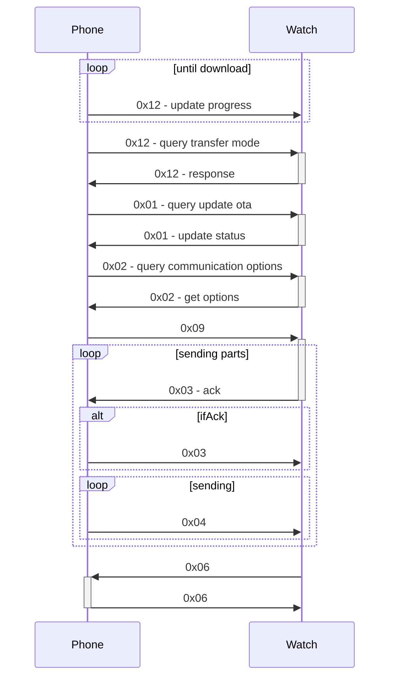

# Service 0x09

## Commands

- 1 - queryOtaAllow
- 2 - queryOtaAllowHandle
- 3 - 
- 4 - 
- 6 - parserPackageVerifyReport
- 9 - transfer file
- 10 - 
- 11 - checkDeviceReadyForUpdate
- 13 - sendUpdateChange
- 14 - sendUpdateMessage
- 15 - sendDeviceRequestCheckAnswer
- 16 - answerDeviceRequestStatus/answerDeviceRequestDownloadOta
- 17 - answerUserIsAgreeDownload
- 18 - sendOtaDownloadPercent
- 19 - queryDeviceTransmitMode
- 20 - sendChangelogToDevice
- 21 - queryChangelogFromDevice

## State graph 

0x126d - first file send  (contains OTA File Size)
AFter first part is sent         Watch->>Phone: 0x05

20 block in first segment
- fist
0x126d
        0x2a0f - once 
        0x1280 once
0x2c0f - mostly

